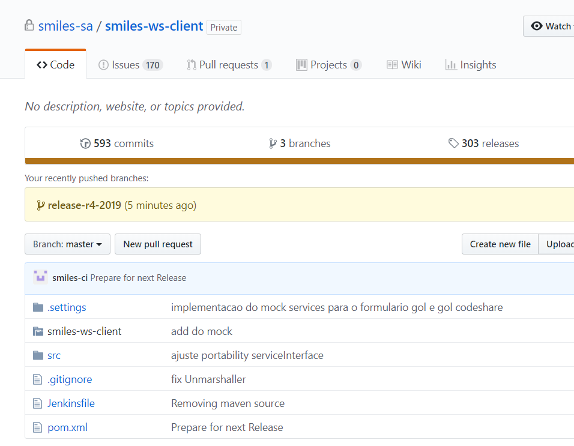
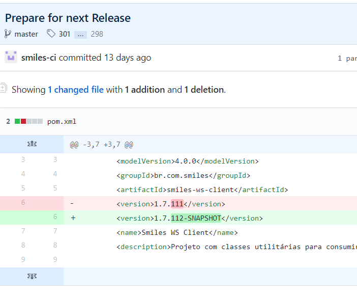

# smiles-ws-client update:

## What?
https://github.com/smiles-sa/smiles-ws-client
=> 
It's the WS Service for Smiles-SA.  
The project generates a `.war` that is imported on other projects' `pom.xml` and provides the interface for a nice communication between Java projects (such as portlets) and OSBs.

## structure
```
.──
	├── src
	│		├── main 
	│		│		├──	java > br > com > smiles > ws > client
	│		│		│		├── binding > adapter
	│		│		│		└── handlers
	│		│		└── resources
	│		│				├── WSDL
	│		│				│		└── // wsdl files (method definitions)
	│		│				├── XSD
	│		│				│		└── // xsd files (object definitions)
	│		│				├── // other files
	│		│				└── services.xml // SOAP definitions for endpoints
	│		└── test
	│				└──	java > br > com > smiles
	│						├── adapters
	│						├── services
	│						│		├── mock
	│						│		│		├── util
	│						│		│		└── // WSDL mock classes
	│						│		└── // testing classes with functions simulating a request
	│						└── Main.java
	├── // ...
	└── pom.xml
```
`.wsdl` and `.xsd` files inside `src/main/resources` are called contracts.
They are the definitions that will generate the classes that will be used by whatever services is importing **ws-client**.

## Changing or adding a method from WS-Client:
- 1. Locate the WSDL (if the method will be added or changed) and the XSD (if attributes will be added or changed)
- 2. Locate the tests related with the change - tests may have to be changed in the way they are called, depending on which changes will be done.
- 3. Compile it locally:
    - run the command 
        `mvn --batch-mode -B -V -U -e -Dmaven.test.failure.ignore=true clean compile`
    - or, in case you wish to use a different maven configuration for the ws compiling, explicitly point the desired `.m2` configuration:
        `mvn -Dmaven.repo.local=C:\Smiles\.m2 clean install`
- 4. If everything worked fine, you can commit your changes.

## Commiting and updating version for testing:
- 5. After commit, repo will be updated with a message:
	`*smiles-ci* Prepare for next Release`

- 6. Click on the message and you will see the diff with the new version that will be used

- 7. Open your project's `pom.xml` and locate the node which defines the  
	`<smiles.ws.client.version>1.7.112-SNAPSHOT</smiles.ws.client.version>`
- 8. changing the version will force the portlet to download the newest changes on `smiles-ws-client`. The new version shall already have your new code.
- 9. Open a beer and enjoy the magic of Java.


